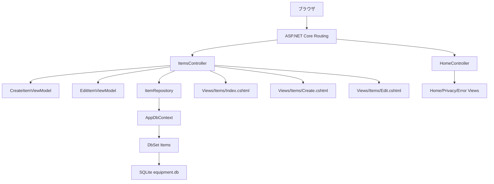
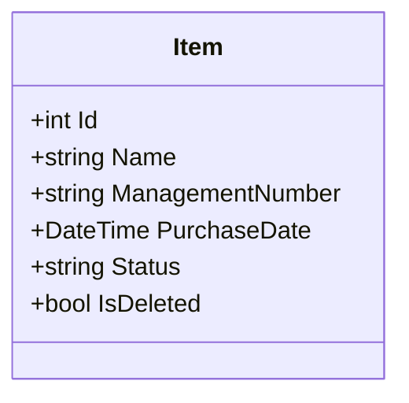
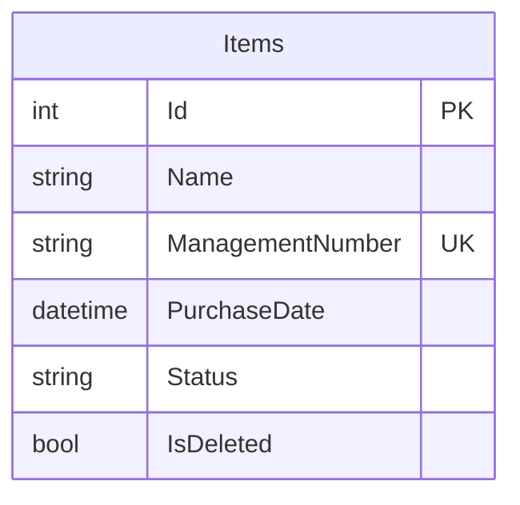
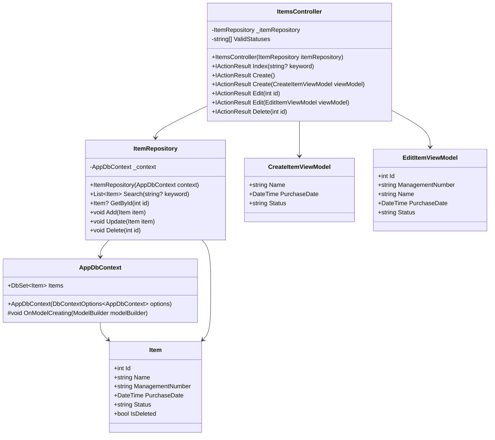
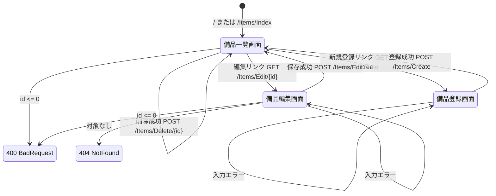
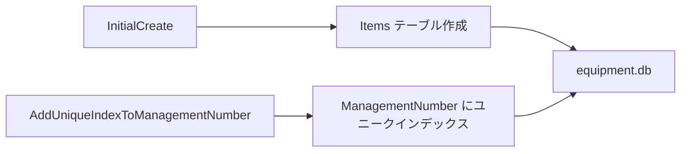

# EquipmentManagement ソースコード解析資料

作成日: 2026-05-06

## 1. 概要

このプロジェクトは ASP.NET Core MVC で作成された備品管理アプリケーションです。  
主な機能は、備品の一覧表示、キーワード検索、新規登録、編集、削除です。データ保存には Entity Framework Core と SQLite を使用しています。

現在の構成では、`ItemsController` が画面遷移と入力チェックを担当し、`ItemRepository` が `AppDbContext` を通じて SQLite の `Items` テーブルへアクセスします。

## 2. 全体構成

## 3. レイヤー構成

| レイヤー | 主なファイル | 役割 |
| --- | --- | --- |
| 起動・設定 | `Program.cs` | MVC、DB、Repository、ルーティングを登録する |
| Controller | `Controllers/ItemsController.cs` | HTTPリクエストを受け、画面表示・入力検証・Repository呼び出しを行う |
| Repository | `Repositories/ItemRepository.cs` | `Item` データの検索、取得、登録、更新、削除を行う |
| Data | `Data/AppDbContext.cs` | EF Core の DB コンテキスト。`Items` テーブルとモデル設定を管理する |
| Model | `Models/Item.cs` | DBに保存する備品データ構造 |
| ViewModel | `ViewModels/CreateItemViewModel.cs`, `ViewModels/EditItemViewModel.cs` | 登録画面・編集画面の入力データ構造 |
| View | `Views/Items/*.cshtml` | 備品一覧・登録・編集画面を表示する |

## 4. データ構造

### 4.1 Item

`Item` は備品情報を表す永続化モデルです。EF Core により SQLite の `Items` テーブルへ対応します。

| プロパティ | 型 | 初期値 | 属性・制約 | 内容 |
| --- | --- | --- | --- | --- |
| `Id` | `int` | `0` | 主キー、自動採番 | 備品を識別するID |
| `Name` | `string` | `string.Empty` | `Required`, `StringLength(100)` | 備品名 |
| `ManagementNumber` | `string` | `string.Empty` | DB側でユニークインデックス | 管理番号。登録後に `ITEM-0001` の形式で設定される |
| `PurchaseDate` | `DateTime` | `default` | `Required` | 購入日 |
| `Status` | `string` | `string.Empty` | `Required`, `StringLength(20)` | 備品の状態 |
| `IsDeleted` | `bool` | `false` | なし | 論理削除フラグ |

### 4.2 CreateItemViewModel

登録画面の入力データを表します。DB保存用の `Item` とは分けられており、登録時に Controller 内で `Item` へ変換されます。

| プロパティ | 型 | 初期値 | 属性・制約 | 内容 |
| --- | --- | --- | --- | --- |
| `Name` | `string` | `string.Empty` | `Required`, `StringLength(100)` | 登録する備品名 |
| `PurchaseDate` | `DateTime` | `default` | `Required` | 登録する購入日 |
| `Status` | `string` | `string.Empty` | `Required`, `StringLength(20)` | 登録する状態 |

### 4.3 EditItemViewModel

編集画面の入力データを表します。編集画面では `ManagementNumber` を読み取り専用表示します。

| プロパティ | 型 | 初期値 | 属性・制約 | 内容 |
| --- | --- | --- | --- | --- |
| `Id` | `int` | `0` | Controller側で `0` 以下を拒否 | 編集対象ID |
| `ManagementNumber` | `string` | `string.Empty` | 画面上は readonly | 管理番号 |
| `Name` | `string` | `string.Empty` | `Required`, `StringLength(100)` | 編集後の備品名 |
| `PurchaseDate` | `DateTime` | `default` | `Required` | 編集後の購入日 |
| `Status` | `string` | `string.Empty` | `Required`, `StringLength(20)` | 編集後の状態 |

### 4.4 AppDbContext

| メンバー | 型 | 内容 |
| --- | --- | --- |
| `AppDbContext(DbContextOptions<AppDbContext> options)` | コンストラクター | DIからDB接続設定を受け取る |
| `Items` | `DbSet<Item>` | `Items` テーブルへのアクセス口 |
| `OnModelCreating(ModelBuilder modelBuilder)` | `void` | `ManagementNumber` にユニークインデックスを設定する |

## 5. クラス構成

## 6. メソッド一覧

### 6.1 ItemsController

| メソッド | HTTP | 引数 | 戻り値 | 処理内容 |
| --- | --- | --- | --- | --- |
| `ItemsController` | - | `ItemRepository itemRepository` | - | Repository を DI で受け取る |
| `Index` | GET | `string? keyword` | `IActionResult` | 検索キーワードを検証し、Repositoryで検索して一覧画面を表示する |
| `Create` | GET | なし | `IActionResult` | 購入日と状態の初期値を入れた登録画面を表示する |
| `Create` | POST | `CreateItemViewModel viewModel` | `IActionResult` | 購入日・状態・ModelStateを検証し、`Item` に変換して登録する |
| `Edit` | GET | `int id` | `IActionResult` | IDを検証し、対象備品を取得して編集画面を表示する |
| `Edit` | POST | `EditItemViewModel viewModel` | `IActionResult` | ID、存在、購入日、状態を検証し、対象備品を更新する |
| `Delete` | POST | `int id` | `IActionResult` | IDを検証し、対象備品を論理削除する |

### 6.2 ItemRepository

| メソッド | 引数 | 戻り値 | 処理内容 |
| --- | --- | --- | --- |
| `ItemRepository` | `AppDbContext context` | - | DBコンテキストを受け取る |
| `Search` | `string? keyword` | `List<Item>` | `IsDeleted == false` の備品を対象に、名称・管理番号・状態で検索する |
| `GetById` | `int id` | `Item?` | 指定IDかつ未削除の備品を1件取得する |
| `Add` | `Item item` | `void` | トランザクション内で備品を追加し、採番後に管理番号を設定する |
| `Update` | `Item item` | `void` | 既存備品の名称、購入日、状態を更新する |
| `Delete` | `int id` | `void` | `IsDeleted = true` に更新して論理削除する |

## 7. 画面遷移

## 8. 機能別詳細

### 8.1 一覧・検索

1. 利用者が一覧画面を開く。
2. 既定ルート `{controller=Items}/{action=Index}/{id?}` により `ItemsController.Index` が呼ばれる。
3. `keyword` が100文字を超える場合は ModelState にエラーを追加し、100文字まで切り詰める。
4. `ItemRepository.Search(keyword)` を呼び出す。
5. Repository は `IsDeleted == false` のデータを対象にする。
6. キーワードがある場合、`Name`、`ManagementNumber`、`Status` のいずれかに含まれるデータを抽出する。
7. `Id` 昇順で一覧画面へ渡す。

### 8.2 登録

1. `GET /Items/Create` で登録画面を表示する。
2. 初期値として `PurchaseDate = DateTime.Today`、`Status = ValidStatuses[0] 相当` を設定する。
3. `POST /Items/Create` で `CreateItemViewModel` を受け取る。
4. 購入日が未来日の場合はエラーにする。
5. 状態が `ValidStatuses` に含まれない場合はエラーにする。
6. 検証成功時、`CreateItemViewModel` から `Item` を生成する。
7. `ItemRepository.Add(item)` でDBへ保存する。
8. 保存後、一覧画面へリダイレクトする。

### 8.3 編集

1. `GET /Items/Edit/{id}` で編集画面を表示する。
2. `id <= 0` の場合は `BadRequest` を返す。
3. 対象備品が存在しない場合は `NotFound` を返す。
4. 取得した `Item` を `EditItemViewModel` へ変換する。
5. `POST /Items/Edit` で `EditItemViewModel` を受け取る。
6. ID、存在、購入日、状態を検証する。
7. 検証成功時、更新用 `Item` を生成して Repository に渡す。
8. 保存後、一覧画面へリダイレクトする。

### 8.4 削除

1. 一覧画面の削除フォームから `POST /Items/Delete/{id}` を送信する。
2. `id <= 0` の場合は `BadRequest` を返す。
3. `ItemRepository.Delete(id)` を呼ぶ。
4. Repository は対象の `IsDeleted` を `true` にして保存する。
5. 一覧画面へリダイレクトする。

## 9. 画面とModelの対応

| 画面 | ファイル | Model | 主要操作 |
| --- | --- | --- | --- |
| 備品一覧 | `Views/Items/Index.cshtml` | `List<EquipmentManagement.Models.Item>` | 検索、新規登録へ遷移、編集へ遷移、削除POST |
| 備品登録 | `Views/Items/Create.cshtml` | `CreateItemViewModel` | 登録POST、一覧へ戻る |
| 備品編集 | `Views/Items/Edit.cshtml` | `EditItemViewModel` | 保存POST、一覧へ戻る |

## 10. DB構成とMigration

| Migration | 内容 |
| --- | --- |
| `20260504033210_InitialCreate` | `Items` テーブルを作成する |
| `20260504062326_AddUniqueIndexToManagementNumber` | `ManagementNumber` にユニークインデックスを追加する |

## 11. 現在の注意点

| 項目 | 内容 |
| --- | --- |
| 文字化け | 画面表示文言、エラーメッセージ、状態値に文字化けが含まれています。コード上の状態値も文字化け後の文字列で検証されています。 |
| 管理番号採番 | `ItemRepository.Add` は登録後に `Id` を使って `ManagementNumber` を設定します。現在はトランザクションで囲まれています。 |
| ユニーク制約 | `ManagementNumber` にはユニークインデックスがあります。登録時の一時状態や既存データに注意が必要です。 |
| 論理削除 | 削除は物理削除ではなく `IsDeleted = true` です。DBにはデータが残ります。 |
| Repository責務 | Repository が検索、採番、トランザクション、論理削除まで担当しています。 |

